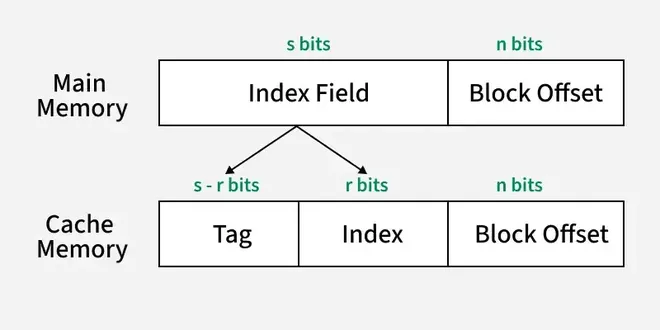

# Different cache mappings #

1. Direct Mapping
2. Fully Associative Mapping
3. Set-Associative Mapping

### Direct mapping ###
cache line = cache block
cache block size - the size of the data field of a cache 

main memory means the whole memory space to be mapped to the cache.

If the main memory address is 32 bits, the maximum memory space it can represent is 2^32 bytes. 

If the cache is 64kb, the block size is 32 byte, then we would need log2(64 * 1024 / 32) = 11 bits for index. 

we need 5 bits for block offset.

the tag bits is 32 - 16 - 5 = 11 bits. 

What is the tag bits? The tag bits is used to identify the memory blocks. 

since the cache memory size is 64kb, it is 16bits in total to represent this memory space. So the main memory could be represented by 2^32 / 2^16 blocks. Each block is the size of the cache.

The main memory could also be divided into 2^32 / 2^5 total lines, and the cache line should be main memory line number % total cache line number. 

In this case, the tag bits are sufficient to represent all memory blocks in the main memory.
